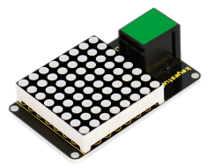

# KS0139 keyestudio EASY plug I2C 8x8 LED Matrix



## 1. Introduction

What's better than a single LED? Lots of LEDs! A fun way to make a small display is to use an 8x8 matrix.

This module uses HT16K33 chip to drive an 8x8 dot matrix. Just need to use the I2C communication port of microcontroller to control the dot matrix, which can save more port resources of microcontroller.

The four pin of this module is integrated into a crystal plug. All you need to do is connect the module to control board for communication using an RJ11 cable.

This module should be used with EASY plug control board.

**Special Note:**

The sensor/module is equipped with the RJ11 6P6C interface, compatible with our keyestudio EASY plug Control Board with RJ11 6P6C interface.

If you have the control board of other brands, it is also equipped with the RJ11 6P6C interface but has different internal line sequence, can’t be used compatibly with our sensor/module.

## 2. Specification

- Interface: Easy plug
- Supply voltage: 4.5V-5.5V
- Maximum display: 16*8
- Size: 56 * 32mm * 18mm
- Weight: 14.7g

## 3. Connection Diagram


## 4. Upload the Code

Download Resource : [Resource](./Resource.7z)

Note： before uploading the code, you need to import the library files; otherwise, the code upload will fail.

```c
#include <Wire.h>
#include "Adafruit_LEDBackpack.h"
#include "Adafruit_GFX.h"

#ifndef _BV
#define _BV(bit) (1<<(bit))
#endif

Adafruit_LEDBackpack matrix = Adafruit_LEDBackpack();

uint8_t counter = 0;

void setup() 
{
  Serial.begin(9600);
  Serial.println("HT16K33 test");
  matrix.begin(0x70);  // pass in the address
}

void loop() 
{
  // paint one LED per row. The HT16K33 internal memory looks like
  // a 8x16 bit matrix (8 rows, 16 columns)
  for (uint8_t i=0; i<8; i++) 
  {
    // draw a diagonal row of pixels
    matrix.displaybuffer[i] = _BV((counter+i) % 16) | _BV((counter+i+8) % 16)  ;
  }
  // write the changes we just made to the display
  matrix.writeDisplay();
  delay(100);
  counter++;
  if (counter >= 16) counter = 0;  
}
```

